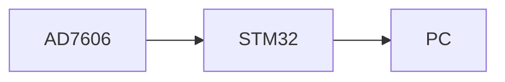

This is a description of a teaching experience. You can use markdown like any other post.

# head

sksksk


[my link](/_pages/cv.md)



```c
aaaa;
int 1

```

111

## head

Heading 1
======


Heading 2
======

Heading 3
======
